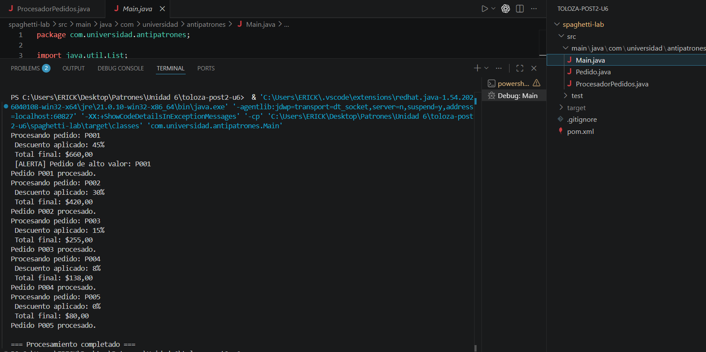
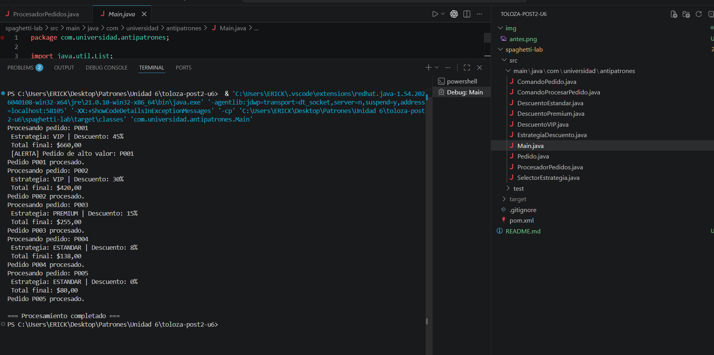

# 📚 Refactoring Lab – Sistema de Procesamiento de Pedidos (Strategy & Command)

## Descripción

Este proyecto consiste en la refactorización de un sistema de procesamiento de pedidos que inicialmente presentaba un antipatrón de diseño conocido como **Spaghetti Code**.

El objetivo fue limpiar la lógica del sistema aplicando los patrones **Strategy** (para el manejo de descuentos) y **Command** (para desacoplar las operaciones sobre los pedidos), mejorando la legibilidad y reduciendo la complejidad ciclomática.

## Antipatrón identificado: Spaghetti Code

El sistema original utilizaba una estructura de control excesivamente compleja con múltiples sentencias `if-else` y `switch` anidados para gestionar las diferentes reglas de negocio.

Esto provocaba:
* **Complejidad Ciclomática alta:** El código era difícil de seguir y depurar.
* **Rigidez:** Agregar un nuevo tipo de descuento o una nueva acción requería modificar el núcleo del programa.
* **Código "frágil":** Cualquier pequeño cambio podía romper una funcionalidad no relacionada.

## Patrones aplicados

Para solucionar el código espagueti, se implementaron dos patrones de diseño de comportamiento:

1.  **Patrón Strategy:** Se utilizó para encapsular las diferentes lógicas de cálculo de descuentos (Descuento por Porcentaje, Descuento Fijo, Sin Descuento), permitiendo cambiar la estrategia en tiempo de ejecución.
2.  **Patrón Command:** Se aplicó para convertir las operaciones del pedido (Guardar en BD, Enviar Notificación, Imprimir Recibo) en objetos independientes, eliminando el acoplamiento directo entre el procesador y las acciones.

## Estructura Refactorizada

El sistema fue dividido en las siguientes clases y componentes:
* `Pedido`: Clase modelo.
* `DescuentoStrategy` (Interfaz): Define el contrato para las estrategias de precio.
* `ComandoPedido` (Interfaz): Define la ejecución de acciones.
* `ProcesadorPedidos`: Actúa como contexto para las estrategias e invocador para los comandos.

---

## Antes de la refactorización

Inicialmente, toda la lógica de validación, cálculo de descuentos y ejecución de acciones estaba mezclada en un solo método lleno de condicionales.

### 📸 Ejecución del sistema (ANTES)

---

## Después de la refactorización

Tras aplicar los patrones **Strategy** y **Command**, el sistema ahora es modular. Cada regla de descuento y cada acción es una clase independiente.

Esto permitió:
* **Principio Abierto/Cerrado:** Se pueden agregar nuevos descuentos o acciones sin tocar el código existente.
* **Testabilidad:** Cada comando y estrategia se puede probar por separado.
* **Claridad:** El método principal es ahora corto y fácil de entender.

---

### Ejecución del sistema (DESPUÉS)

---